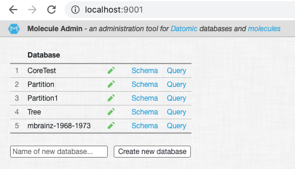

# MoleculeAdmin for Datomic dbs

[](https://gitter.im/scalamolecule/Lobby?utm_source=badge&utm_medium=badge&utm_campaign=pr-badge)

An advanced web app (built with [ScalaJS](http://www.scala-js.org)) to 
administrate [Datomic](https://www.datomic.com/on-prem.html) databases:

- Create and delete Datomic databases.
- Build and update Datomic database schemas.
- Build and run complex queries from a graphical query builder or directly with [molecules](http://www.scalamolecule.org).
- Sort, filter, group and browse large data sets easily and fast.
- Add/edit data directly in table cells with easy key-command navigation.
- Perform custom group edits on any number of entities.
- Recursively expand entities with simple mouseovers for fast exploration.
- Watch/undo transaction history.
- See/edit grouped values.
- Shows queries as molecules and datalog queries (for easy copy/paste).
- Automatic query optimization for fast query performance.

MoleculeAdmin uses [molecules](http://www.scalamolecule.org) as a query representation. 
But it can be used without knowing about/using molecules or Scala for that matter 
(Clojure/Java folks are welcome!).

For performing Datalog queries, please use the official 
[Datomic Console](https://my.datomic.com/account/create) (requires registration 
or using a Pro version of Datomic).


## Download

To explore MoleculeAdmin with the mBrainz sample database,
1. Download a Datomic distribution like the [free version](https://my.datomic.com/downloads/free)
2. Download and untar the [mBrainz](https://github.com/Datomic/mbrainz-sample) sample database
   ```
   cd datomic-free-0.9.5703.21
   wget https://s3.amazonaws.com/mbrainz/datomic-mbrainz-1968-1973-backup-2017-07-20.tar -O mbrainz.tar
   tar -xvf mbrainz.tar
   ```
3. Start the transactor in its own process
   ```
   bin/transactor config/samples/free-transactor-template.properties
   ```
4. In another process (open new tab/window in your terminal), install the mbrainz database
   ```
   bin/datomic restore-db file:mbrainz-1968-1973 datomic:free://localhost:4334/mbrainz-1968-1973
   ```
5. Download MoleculeAdmin
   ```
   cd ..
   git clone https://github.com/scalamolecule/molecule-admin.git
   ```

## Use MoleculeAdmin

Having downloaded and installed all the necessary parts listed above,

1. Start the Datomic transactor in its own process, something like this (might 
already be running):
   ```
   cd datomic-free-0.9.5703.21
   bin/transactor -Xmx4g -Xms4g -Ddatomic.txTimeoutMsec=120000 config/samples/free-transactor-template.properties
   ```
2. In another process, start the application:
   ```
   cd molecule-admin
   sbt run
   ```
3. Wait for the server to have started:
   ```
   (Server started, use Enter to stop and go back to the console...)
   ```
4. Then open [localhost:9001](http://localhost:9001) - this can take a while the 
first time since all dependencies are resolved and the whole project compiled 
(check progress in terminal).
   
You should arrive at a list of current databases, something like this (if you
haven't already created other databases):



A few more sample databases were also created that you can freely play 
around with by exploring their `Schema` or perform a `Query`:
- CoreTest - contains all possible data types. Note how the Schema defines those
and how the query builder takes each type into consideration and only allow 
valid settings.
- Partition/Partition1 - exploring multiple partitions that each contains one or 
more namespaces.
- Tree - Used to test building complex hierarchies with the query builder. 
- mBrainz - large real data set that can give a sense of the query builder
capabilities and the paging/editing features.

It's recommended to use MoleculeAdmin in the Google Chrome browser for expected 
look and behaviour.


## Enable your own Datomic database

For MoleculeAdmin to be able to work with a database it needs a path to a
[schema definition file](http://www.scalamolecule.org/manual/schema/) which is
a `molecule` representation of a Datomic database schema. You don't need to use
molecules or Scala to use MoleculeAdmin, as long as you provide a schema 
definition file that defines your Datomic database schema. Once you have created 
such file you can enter its full path into MoleculeAdmin:


### Schema development in Scala

Molecule uses the schema definition file as a blueprint for generating Scala
boilerplate code that you can use to make type safe queries in Scala against 
a Datomic database.

In the first life cycles of a Scala project, you'll likely develop your database schema
by writing a lot of changes directly to the schema definition file and re-compile
the project regularly to have the boilerplate code reflecting your changes.

But when the schema 
stabilizes and you start to enter real data into the database, you'll want a more
flexible way to make changes to the schema and at the same time have those
changes continuously propagated to your generated boilerplate. This is when
MoleculeAdmin can "take over" the responsibility of keeping your schema definition
file in sync with your database. So instead of you writing manually to the schema 
definition file, you let MoleculeAdmin write changes directly to it. 

### Clojue/Java users

For Clojure/Java users not using Scala, it would be cool if we could use the newer
Datomic feature of exporting the schema definition for a database
in order to automatically generate a schema definition file. Since the free
version of Datomic is not up to date and the export feature not available in 
the current older version, we can't yet automate this process and you'll have to 
make such [schema definition file](http://www.scalamolecule.org/manual/schema/) 
manually for now.


## Development

If you have questions or ideas, please feel free to discuss in the gitter channel:

[](https://gitter.im/scalamolecule/Lobby?utm_source=badge&utm_medium=badge&utm_campaign=pr-badge)

Or you can submit [issues](https://github.com/scalamolecule/molecule-admin/issues) /
[pull requests](https://github.com/scalamolecule/molecule-admin/pulls) too.


## Test

Run all internal MoleculeAdmin test by platform:
``` 
sbt
server> server/test
server> sharedJVM/test
server> sharedJS/test
```

.. or run individual tests:
```
sbt
server> server/testOnly moleculeadmin.servertest.log.LatestTxs
server> sharedJVM/testOnly moleculeadmin.sharedtest.util.DateTransformation
server> sharedJS/testOnly moleculeadmin.sharedtest.util.DateTransformation
```


## Compile

```
> sbt clean compile
> sbt sharedJS/fastOptJS
```

## Credits

- Big credits go to Datomic's own [Console](https://my.datomic.com/account/create)
that can make all possible queries with Datalog against Datomic databases. 
MoleculeAdmin can make a subset of those queries, but hopefully enough to be 
useful, also given its capability to edit data and schema.
- [OpenRefine](https://openrefine.org) (earlier "GoogleRefine") - a sophisticated 
editor of tabular data that has served as a great inspiration for MoleculeAdmin!


#### Author
Marc Grue

#### License
Molecule is licensed under the [Apache License 2.0](http://en.wikipedia.org/wiki/Apache_license)